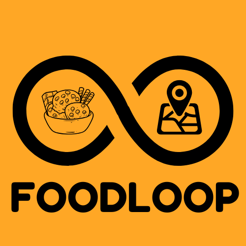

<!-- README.md -->

<div align="center">
  
  <h1><b>🍱 FoodLoop</b></h1>
  

  <p align="center">
    An AI-powered, blockchain-integrated food donation platform enabling real-time food recovery, transparency, and impact. <br />
    Developed by <strong>Team Tech Sangam</strong> 🌱
  </p>
</div>

---

## 🚀 Features

### 🔥 Real-Time Surplus Food Marketplace
- Quick upload of food listings by hotels, cafes, or individuals.
- Automatic food classification using AI (packaged, perishable, hot meals).
- Quality verification using computer vision & expiry validation.

### 📍 AI-Powered Location-Based Matching
- Matches donors to NGOs based on proximity & urgency.
- Optimizes delivery routes to reduce spoilage.
- Prioritizes time-sensitive food donations.

### 📦 Smart Order Management for NGOs
- NGOs can browse, claim, or subscribe to food types.
- Real-time notification system on listing updates and confirmations.

### 🔗 Blockchain-Powered Transparency
- Immutable donation records for tracking and audits.
- Instant smart contracts for confirming deliveries.
- Auto-generated proof of donation for CSR and tax benefits.

### 📊 Impact Analytics Dashboard
- Track total food saved, carbon credits, and donation impact.
- Personalized insights for donors and NGOs.

 ### 🎉 NEW: JoyLoop (Community Impact Wall)
-  Users can upload images/videos of joyful moments from donations.
-  Builds community trust and emotional impact of donations.
-  Displays user-submitted content to inspire others.
-  Top Donors Leaderboard

---

## 🤖 AI & Automation

- **False Listing Detection** using image classification to eliminate spoiled or fake entries.
- **Predictive Surplus Forecasting** based on donation trends.
- **Smart Matching** using ML-based urgency and geo-prioritization.

---

## 💼 Economic Model

| Revenue Channel        | Description                                                                 |
|------------------------|-----------------------------------------------------------------------------|
| Freemium for Businesses| Basic listings free; premium plans offer analytics & priority features     |
| Commission Model       | Small fee on paid donations for operational cost                           |
| CSR & Government Ties  | Partnership with CSR arms for tax incentives & carbon credits               |
| Ad Space (Optional)    | Green brands can advertise ethically                                       |
| Carbon Credit Trade    | Earn and trade carbon credits through verified donations                   |

---

## 🧠 Tech Stack

| Category      | Tools & Frameworks                                  |
|---------------|-----------------------------------------------------|
| Frontend      | React.js, Tailwind CSS, Material UI, GSAP, ThreeJS, Flutter,  |
| Backend       | Node.js, Express.js, MongoDB, FastAPI                         |
| AI & Vision   | TensorFlow.js, Hugging face, Open CV, Keras, SciKit Learn, Pytorch     |
| Blockchain    | Solidity, Smart Contracts      |
| Maps & Routes | Google Maps API, GeoLocation API                    |
| Deployment    | Vercel/Render 

---

## 📱 Mobile App (Flutter)

- Browse & claim donations on-the-go (NGOs)
- Submit and track food listings (Donors)
- Real-time push notifications
- Light and fast experience

---

## 🚀 Getting Started

### Prerequisites
```bash
node >= 14.0.0
npm >= 6.0.0
MongoDB >= 4.0.0
```

### Installation
1. Clone the repository
```bash
git clone https://github.com/Hitanshi-Singh/FoodLoop.git

```

2. Install dependencies
```bash
npm install
```

3. Set up environment variables
```bash
cp .env.example .env
# Edit .env with your configuration
```

4. Start the development server
```bash
npm run dev
```
## 📝 Contributing

Please read [CONTRIBUTING.md](CONTRIBUTING.md) for details on our code of conduct and the process for submitting pull requests.

## 📄 License

This project is licensed under the MIT License - see the [LICENSE](LICENSE) file for details

## 🤝 Support

For support, reach out to us on email.

---

### 🌍 Connect With Us

### 📧 Email: TBA

### 🐦 Twitter: TBA

### 💼 LinkedIn: TBA

---

## 👥 Meet the Team – Tech Sangam

> A passionate group of innovators committed to reducing food waste and fighting hunger through technology.

| Name               | 
|--------------------|
| **Sankalp Nadiger**   |  
| **Ritesh N**     |  
| **Hitanshi Singh**     | 
| **Namrata**    | 
| **Vaibhav M N**       | 
| **Sujith** | 

---

<h2><i>“Be the reason someone eats today. Loop the joy. FoodLoop.”</i></h2>
